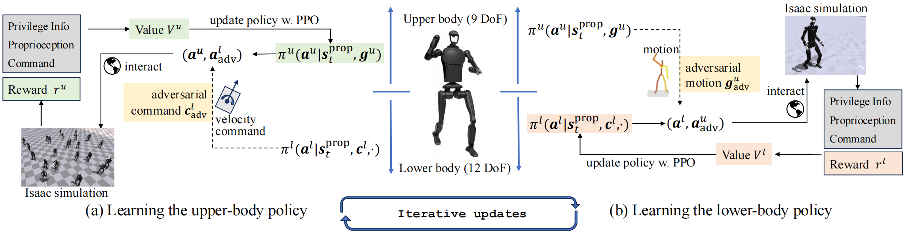
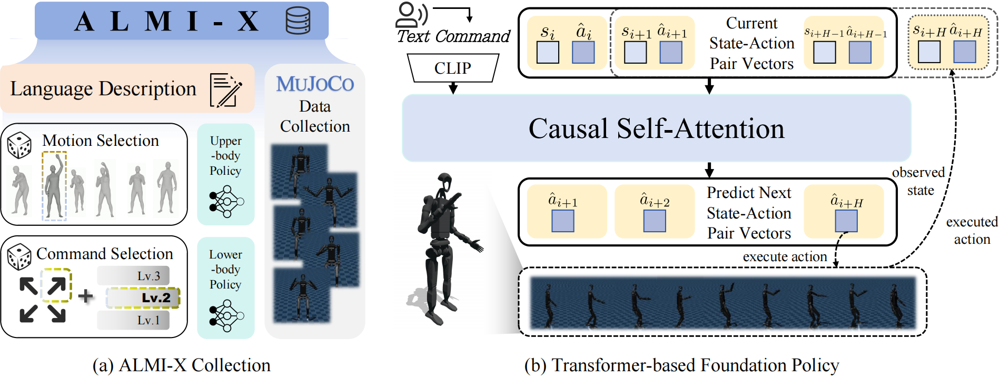

<h1 align="center"> Adversarial Locomotion and Motion Imitation for Humanoid Policy Learning </h1>

<div align="center">

[[Website]](https://almi-humanoid.github.io)
[[Arxiv]](https://arxiv.org/abs/2504.14305)
[[Dataset]](https://huggingface.co/datasets/TeleEmbodied/ALMI-X)




</div>

## TODO
- [x] Release ALMI training code
- [ ] Release ALMI deployment code
- [x] Release ALMI-X dataset collection code
- [x] Release ALMI-X foundation model training code
- [x] Release ALMI-X foundation model's checkpoint and inference code

## Overview

In this repository, we release "ALMI policy training code" in `ALMI_RL`, "ALMI-X dataset collection code" in `Data_Collection`, "ALMI-X foundation model training and inference code" in `ALMI_trans`. Please refer to [ALMI_RL](/ALMI_RL/README.md), [Data_Collection](/Data_Collection/README.md) and [ALMI_trans](/ALMI_trans/README.md) for installation and usage. You can also download our trained foundation model checkpoints at [ALMI-trans](https://huggingface.co/TeleEmbodied/ALMI-trans)



## Citation
If you find our work useful, please consider citing us!
```
        @misc{shi2025almi,
          title={Adversarial Locomotion and Motion Imitation for Humanoid Policy Learning}, 
          author={Jiyuan Shi and Xinzhe Liu and Dewei Wang and Ouyang Lu and Sören Schwertfeger and Fuchun Sun and Chenjia Bai and Xuelong Li},
          year={2025},
          eprint={2504.14305},
          archivePrefix={arXiv},
          primaryClass={cs.RO},
          url={https://arxiv.org/abs/2504.14305}, 
    }
```


## Acknowledgments

This repository is built upon the support and contributions of the following open-source projects. Special thanks to:

- [unitree\_rl\_gym](https://github.com/unitreerobotics/unitree_rl_gym/tree/main): A repository for reinforcement learning implementation based on Unitree robots, supporting Unitree Go2, H1, H1_2, and G1.

## License


This project is licensed under the [BSD 3-Clause License](./LICENSE):
1. The original copyright notice must be retained.
2. The project name or organization name may not be used for promotion.
3. Any modifications must be disclosed.

For details, please read the full [LICENSE file](./LICENSE).